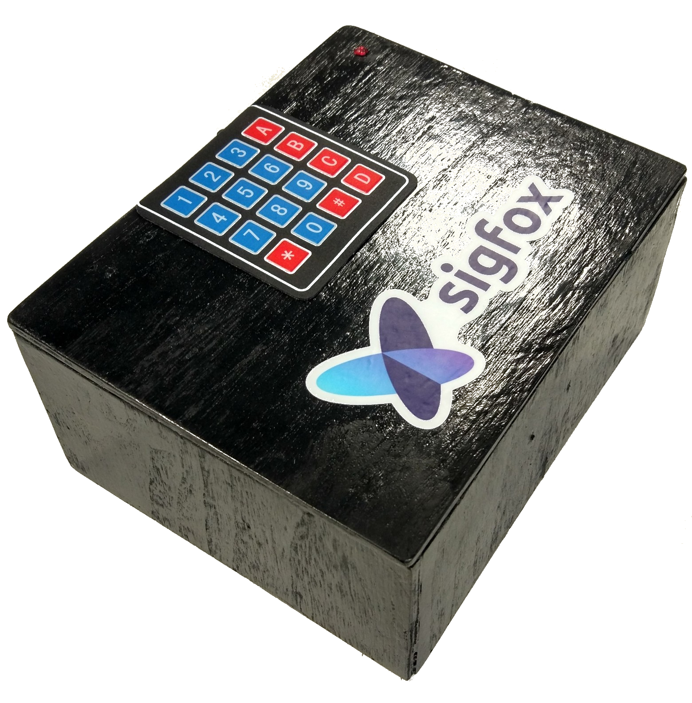
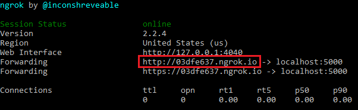
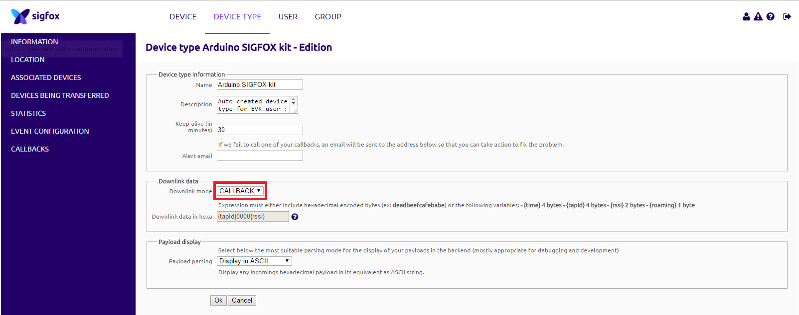
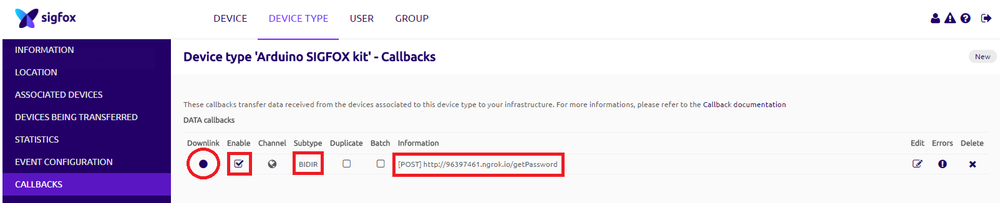

# [MKRFox1200](http://www.sigfox.com/) Lock Box :key:

What if you had to store something precious to be picked up by someone you do not know ?
What if you were far away from the box and had to change the password for security reasons ?

This is where Sigfox comes in ! Indeed, Sigfox allows you to use 4 downlink messages per day. The idea is to be able to update the password controlling the opening of the box. Therefore in this tutorial, every 6 hours (4 times per day), the box's password will be set with a newly generated one from a web application. The owner can then decide to share the password to whom he wants. He will also be notified every time the box is opened !

<p align="center">
    
</p>

This repository includes:
- the firmware to upload on the MKRFox1200
- the web API generating a new password and receiving the box's notifications

A video presentation is available [here](https://www.youtube.com/watch?v=yTfbNe17UA4)!

Some photos showing how the mechanical part works:

:unlock: Opened:
<p align="center">
    
</p>

:lock: Locked:
<p align="center">
    
</p>

Making the box:
<p align="center">
    
</p>

Below is a diagram showing how the global system works:
    <p align="center">
        
    </p>

## Hardware Requirements

- an [MKRFox1200](https://www.arduino.cc/en/Main.ArduinoBoardMKRFox1200) board
- a [4x4 membrane keypad](http://www.ebay.com/itm/4-x-4-Matrix-Array-16-Key-Membrane-Switch-Keypad-Keyboard-for-Arduino-AVR-PI-C-/310511616357)
- a [buzzer](http://www.ebay.com/itm/DC-3-12V-110DB-Discontinuous-Beep-Alarm-Electronic-Buzzer-Sounder-LW-/172369764855?epid=1287039987&hash=item282209e1f7:g:J1wAAOSw-CpX-vgf)
- an [RGB led](https://www.adafruit.com/product/159)
- a [servo motor](http://www.ebay.com/itm/9G-SG90-Micro-Servo-motor-RC-Robot-Helicopter-Airplane-Control-Car-Boat-/172420250871?epid=0&hash=item28250c3cf7:g:jtgAAOSwiDFYNyL8)
- 2x AA batteries or equivalent (in this tutorial I use a [3.7 Li-Ion battery](https://www.adafruit.com/product/1781))
- some [jumper wires](https://www.adafruit.com/product/759) and a breadboard
- a box with a lock system

## Installation
Start by cloning the repo: `git clone https://github.com/AntoinedeChassey/MKRFox1200_lock_box`

### MKRFox1200
1. [Activate](https://backend.sigfox.com/activate/arduino) your board on the Sigfox Backend _(you can follow __[this](https://www.arduino.cc/en/Guide/MKRFox1200)__ and  __[this](https://www.arduino.cc/en/Tutorial/SigFoxFirstConfiguration)__ tutorials)_
2. Flash the MKRFox1200 with the firmware located in this folder: _MKRFox1200_lock_box/MKRFox1200/__src___ (I used __[PlatformIO](http://platformio.org/)__ a new great IDE for IoT. After being installed on Atom, the folder "MKRFox1200" can be imported with `File>Open Folder...>Select` and the project will be configured automatically with the Arduino core and libraries - defined in the file `platformio.ini`)
3. Make sure to respect the correct __pin mapping__ (check `Defines & variables` in the code)

Some informations regarding the data frames being sent from the MKRFox1200 to the Sigfox Backend (_12 bytes maximum_):
- `getPasswordBySigfox()` sends the following:

| Byte | Type | Content |
| ------------- | ------------- | ------------- |
| 1 -> 6  | char  | "UPDATE"  |
| 7 -> 10  | float - Little Endian | Estimated battery voltage |

- `sendAlertBySigfox()` sends the following:

| Byte  | Type | Content |
| ------------- | ------------- | ------------- |
| 1 -> 4  | char  | "OPEN"
| 5 -> 8  | float - Little Endian | Estimated battery voltage |

You can help yourself with [this](http://www.scadacore.com/field-tools/programming-calculators/online-hex-converter/) website to decode hexadecimal (the battery voltage is a `Float - Little Endian (DCBA)`).

__FYI:__ the estimated battery voltage is only indicating a __very__ rough approximation. It is not a reliable piece of information at all but it will help you get an idea. A better approximation would be made with a 5V battery using the following formula: `float voltage = sensorValue * (5 / 1023)`

### Flask API - ngrok
1. Edit the "app.py" script (in folder _MKRFox1200_access_control/__API__/_)
2. Set the `deviceId` variable with your own MKRFox1200 device ID (you can find it when you actived your board or on the [Sigfox Backend](https://backend.sigfox.com/devicetype/list))
3. Install Flask with pip (Linux commands):
    ```bash
    $ sudo apt-get update && sudo apt-get -y upgrade
    $ sudo apt-get install python-pip3
    $ pip3 install flask
    ```
4. Launch the Python script _(on windows, if a PATH environment variable has not been created, the Python executable must be accessible from `C:\Users\USERNAME\AppData\Local\Programs\Python\Python36-32\python.exe`)_:

    ```bash
    $ cd MKRFox1200_access_control/API/
    $ python app.py
    ```

    If everything went fine, you must be able to access http://localhost:5000/ and see a result in your browser.
    There is an endpoint configured to generate a new password when calling http://localhost:5000/getPassword. This will also be used for the Sigfox Backend Callback configuration.

    Now we'll take a look at ngrok as a method of exposing your Python server publicly so that the Sigfox Backend can GET/POST data to it.
    This is particularly useful for testing purposes as we do not have to spend time on server configurations.
5. Install ngrok from __[here](https://ngrok.com/download)__
2. Launch ngrok on port 5000:
    ```bash
    $ ngrok http 5000
    ```
    This will expose your server publicly (on port 5000). To double check that this has worked, copy the address that has appeared in your terminal window under "forwarding" and navigate to it using your browser; it should look something like below. Make note of this as we'll need it below!

    <p align="center">
        
    </p>


### Sigfox Backend Callback
1. Log in __[here](https://backend.sigfox.com/auth/login)__
2. Go to <https://backend.sigfox.com/devicetype/list>, click left on your device row and select "Edit"
3. Under "Downlink data", select the `CALLBACK` "Downlink mode"

    <p align="center">
        
    </p>

4. Now go to the "CALLBACKS" section on the left, select "new" on the top right, select "Custom Callback"
    * Type: `DATA` | `BIDIR`
    * Channel `URL`
    * Url pattern: `http://<YOUR_ngrok_SERVER_ADDRESS>/getPassword`
    * Use HTTP Method: `POST`
    * Content Type: `application/json`
    * Body: _(this will be sent to the API, the "data" variable will hold an approximation of the battery voltage level based on a 3.7V Li-Ion cell as a 4 bytes float)_
    ```javascript
    {
          "device" : "{device}",
          "time" : "{time}",
          "duplicate" : "{duplicate}",
          "snr" : "{snr}",
          "rssi" : "{rssi}",
          "avgSnr" : "{avgSnr}",
          "station" : "{station}",
          "lat" : "{lat}",
          "lng" : "{lng}",
          "seqNumber" : "{seqNumber}",
          "data" : "{data}"
    }
    ```

5. Select "OK" to validate
6. __Tick__ the "Downlink" button to activate the newly created callback, make sure it looks like below

    <p align="center">
        
    </p>

## Usage
- Power up the system
- The default password is `2017`
- The buffer storing the input (keys pressed) is 4 characters long
- This buffer is emptied every 3 seconds and the timer emptying it is paused every time there is a new key being pressed
- Press `*` to reset the input or __lock__ the box
- For debug purposes, you can press `#` to reset the password to its default (2017)
- A new generated password will be set every 6h by default, see: `const long interval = 1000 * 60 * 60 * 6` (this means a downlink will be asked every 6h = 4 per day to the [Sigfox](http://www.sigidwiki.com/wiki/SIGFOX) Backend, this respects the [ETSI](http://www.etsi.org/) Standards)
- The new password will be stored in the MKRFox1200 flash memory (this means that if you reboot the board, the default password (2017) is set again)
- The new password is accessible on the ngrok Python API (home page - http://localhost:5000/)
- Each time the correct password is entered, the message "OPEN" is sent to the Sigfox Backend so the owner can be notified it has been opened by someone (this takes 6 seconds)

## TODO - Going Further
- [x] send notification when the box is opened
- [x] send the approximated voltage of the 3.7V battery when there is a downlink (every 6h)
- [ ] add multi-tasking to allow asynchronous jobs
- [ ] put the board in deepsleep to preserve battery consumption


__Have fun__ and always keep your keys safe! :wink: :key:

> *Antoine de Chassey*
